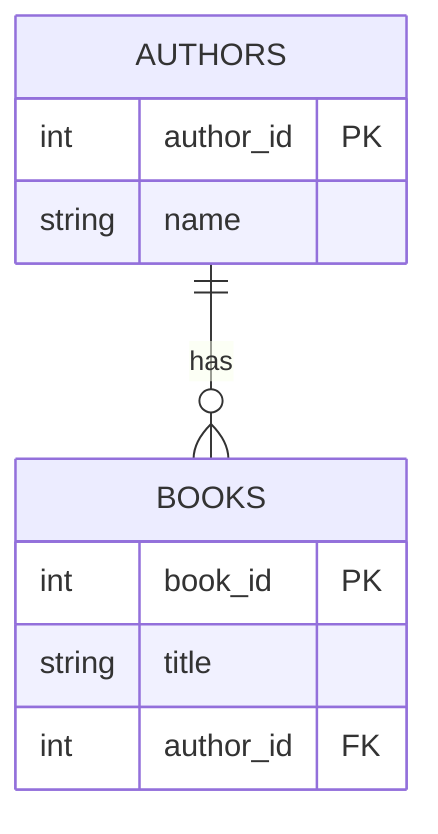

## Entity Relationship Diagram (ERD) — Quick Overview

- ERD visualizes tables (entities), their attributes, and relationships.
- Cardinality: 1:1, 1:N (one-to-many), M:N (many-to-many via a join table).

Example (authors and books):

```
[Authors] (author_id PK) 1 ───< N [Books] (author_id FK → Authors.author_id)
```

M:N pattern (books ↔ categories) via join table:

```sql
CREATE TABLE categories (
  category_id SERIAL PRIMARY KEY,
  name TEXT NOT NULL
);

CREATE TABLE book_categories (
  book_id INT NOT NULL REFERENCES books(book_id) ON DELETE CASCADE,
  category_id INT NOT NULL REFERENCES categories(category_id) ON DELETE CASCADE,
  PRIMARY KEY (book_id, category_id)
);
```

Simple ERD (diagram):


